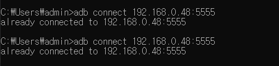
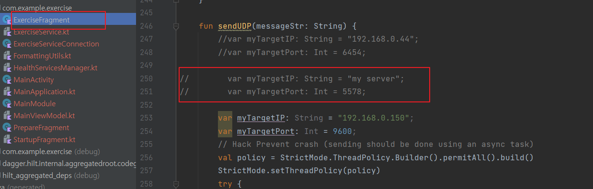
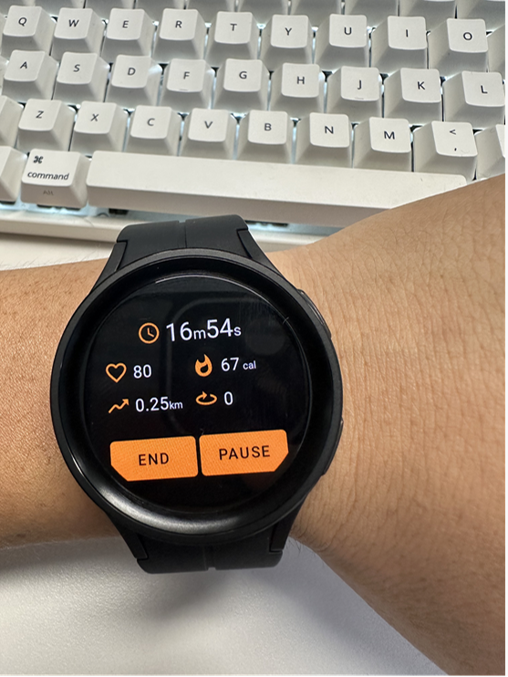
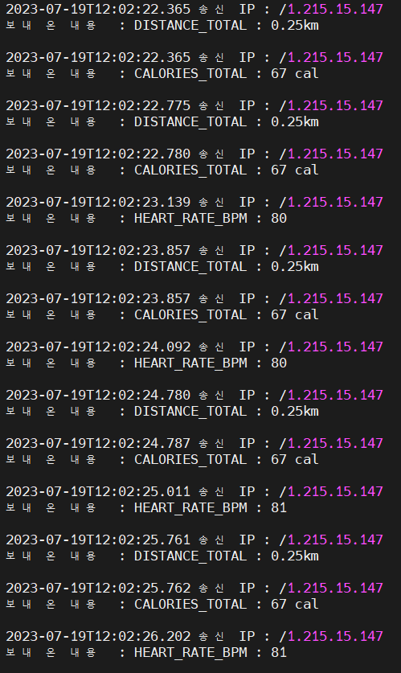

# galaxy_wearos_health_data_export
wear os export  data to gate way , (HEART_RATE_BPM , DISTANCE_TOTAL, CALORIES_TOTAL)
## 1. connect adb with wifi



## 2. write gateway ip, port


## 3. run with real galaxy watch 


## 4. send real time


## 5. receive



## 2. gateway server receive data
```java
import java.net.DatagramPacket;
import java.net.DatagramSocket;
import java.time.LocalDateTime;
public class UDPServer {
    public static void main(String[] args) {
        try {
            DatagramSocket dsoc = new DatagramSocket(5578);
            System.out.println("데이터 수신 준비 완료....");
            while (true) {
                byte[] date = new byte[66536];
                DatagramPacket dp = new DatagramPacket(date, date.length);
                dsoc.receive(dp);
                System.out.println( LocalDateTime.now()+" 송신 IP : " + dp.getAddress());
                String msg = new String(dp.getData(), "UTF-8");
                System.out.println("보내 온 내용  : " + msg);
            }
        } catch (Exception e) {
            System.out.println(e.getMessage()
            );
        }
    }
}
```